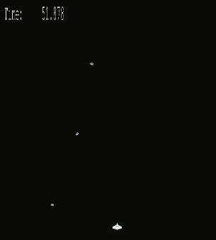
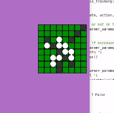

# Proton Project

## Simple 2D game Engine and Reinforcement Learning System

This project contains the following

* a simple 2D game engine, based around the `PyGame` library.
* Q-Learning system for adding reinforcement learning to games.
* several sample games, with some reinforcement learning examples, and `Tensorflow` models, demonstrating the game AI.
* the main  learning source code originally evolved from the book *Hands-On Machine Learning with Scikit-Learn and TensorFlow*, which was modified for TensorFlow 2.

### Machine learning libraries used
Tensorflow 2, Keras, Python 3.8

## How to launch

Using the `requirements.txt` file, use

```
conda create --name <env_name> --file requirements.txt
```

### run

```
python launcher.py --game <PATH_TO_GAME_CONFIG.yml>
```

#### example

```
python launcher.py --game ./games/othello/resources/game4.yml
```
 
### Sample Games

#### Asteroid Dodge
A spaceship can move horizontally to dodge the falling asteroids. This is perhaps the simplest demo game to develop a Q-Learning based AI.



#### Othello
Othello game (also called Reversi). Tricky to develop Q-Learning based AI for. Work in progress.



## Project Structure
```
┌ proton - main source code for the game engine
|
├ tests - a few tests (not many!)
|
├ games - games
    ├ asteroiddodge - source code for asteroid dodge game
    |    ├ resources - contains the TF models, Learing parameter files, image files etc
    | 
    ├ othello - source code for othello game
    |    ├ resources - contains the TF models, Learing parameter files, image files etc
    |
    ├ piratedefense - source code for a terrible demo game

```